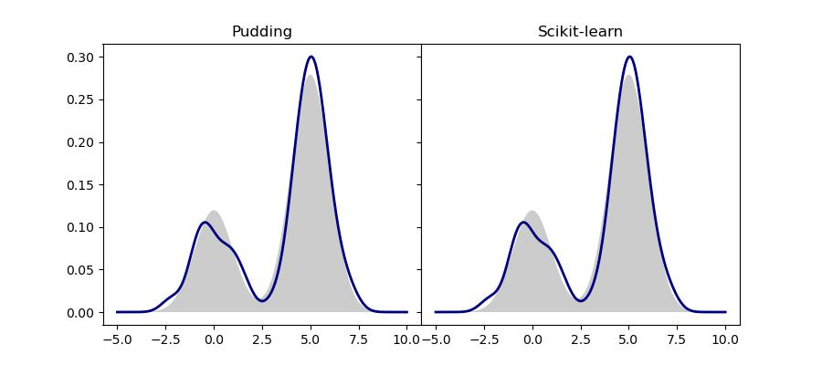

*Many contents below are adopted from Wu's excellent textbook about Pattern Recognition[^1].*

# Kernel Density Estimation (KDE)

KDE is a widely used non-parametric density estimation algorithm. One advantage of non-parametirc estimation methods is that they do not assume any functional form thus are very flexible and require less prior.

## Histogram Approximation

Given a set of i.i.d samples, we'd like to estimate the underlying distribution, how could this be done? One answer to the question is to use histogram approximation. Consider for the simplest 1D case, the procedure is as follows.

1. Find the data range.
2. Determine the number of bins (\\(n\\)) used.
3. Divide the range evenly into \\(n\\) non-overlapping sub-ranges.
4. Each sample now belongs to one sub-range, and we use \\(h(i)\\) to denote the number of examples in the i'th sub-range.
5. Say now we want the estimated probability at point \\(x\\) and let's assume it falls into the j'th bin. Then, the estimated probability is given by: \\[p(x)\propto h(j)\.\\]

It's not hard to see that the intuition behind histogram approximation is simple: **the higher the probability, the more samples we will have**. Although being straightforward and intuitive, histogram approximation also has many problems.

* Discrete estimation. The estimation between the boundaries of bins are not continuous and a fixed estimated value in used within each bin area.
* Not scalable. Above is a simple example in 1D case, when the dimension of data increases, we need to divide sub-ranges in each dimension, which makes the total number of bins increase exponentially.
* Tricky hyperparameters. The number of bins is crucial but tricky to determine.

## Using Kernels

In the histogram approximation method, we can define a function \\(h^{x_i}(x)\\) for each sample \\(x_i\\). \\(h^{x_i}(x)=1\\) if \\(x\\) and \\(x_i\\) lies in the same bin, otherwise equals zero. Using this notation, we can re-write the estimated probability to:\\[p(x)\propto \sum_{i=1}^n h^{x_i}(x)\.\\]

The underlying cause to the above mentioned problems actually is the function \\(h^{x_i}(x)\\). It has several undesirable properties:

* It's not symmetric. If the sample does not lie in the middle of one bin, the number of points that receive its contribution is different on the left and right hand side.
* It has only finite support. Only samples within the same bin receive the contribution, which makes the estimation discrete.
* It has uniform radiation. The contribution of a sample to a point \\(x\\) is unrelated to their distance once they are in the same bin.

Therefore, to tackle the mentioned problems, we need to come up with a better function form for \\(h^{x_i}(x)\\). And this better function form used in KDE is called kernel. In statistical analysis, the term [kernel](https://en.wikipedia.org/wiki/Kernel_(statistics)) is used to refer to a window function. Specifically in nonparametric statistics, a kernel is a weighting function. Formally speaking, kernel \\(K\\) is a non-negative real-valued integrable function. For most applications, we also define it to satisfy two additional requirements:

* Normalization: \\(\int_{-\infty}^{\infty}K(u)du\\).
* Symmetry: \\(K(-u)=K(u)\\).

Using kernels, the estimated probability is now written as:
\\[p(x)=\frac{1}{n}\sum_{i=1}^n\frac{1}{h}K(\frac{x-x_i}{h})\\\,\\]
where \\(h\\) is called bandwidth and serves as a smoothing factor. Intuitively speaking, using larger bandwidth would result in a more smooth probability curve.

For extending KDE to higher dimension space, the estimated probability becomes:
\\[p(x)=\frac{1}{n}\sum_{i=1}^n\left\vert H\right\vert^{-1/2}K(H^{-1/2}(x-x_i))\.\\]
In other words, the bandwidth now becomes a \\(d\times d\\) matrix, where \\(d\\) is the feature dimension.

## KDE in Pudding

It's not hard to see that the computation of KDE involves computing a kernel function between each sample and query point and summing them up. It can be viewed as a [generalized N-body problem](http://www.cs.cmu.edu/~agray/nbody.html) and is very sutiable for GPU acceleration.

To avoid potential flaws in usage, there are a few important things to note here about the implementation of KDE in Pudding.

* The KDE implementation in Pudding supports multivariate inputs. But unlike the most general form we write above, it is necessary to make several assumptions in practice to accelerate the computation. One important assumption I made is that \\(H\\) is diagonal, which yields the KDE employing product kernel. Moreover, since the input data is usually standardized in the pre-processing steps, we can further assume \\(H=\mathrm{diag}(h^2,h^2,\dots,h^2)\\) where \\(h\\) is the arguments in the ```pudding.estimation.kde_score``` function. Actually, [Scikit-learn](https://scikit-learn.org/stable/modules/density.html#kernel-density) also makes such assumption.
* Only Gaussian kernel is supported. Although sounds quite limited but I think actually it should work well in almost all cases. Applying Gaussian kernel is equivalent as constructing a Gaussian Mixture Model, where we have one Gaussian distribution centered at each training sample, such model is powerful and is in fact a universal approximator for continuous distribution. The bandwidth, is actually more important than the kernel in practice.
* KDE also suffers from the curse of dimensionality, meaning its performance will degrade in high dimensions. If you have training samples in high dimensional space, you can use dimension reduction methods like ```pudding.dimension_reduction.pca``` to first project the data into a lower subspace.

# Benchmark Result

The implementation of KDE in Pudding is compared with Scikit-learn's fully optmized version in order to quantify the speed up. You can reproduce the result by simply running the scripts ```scripts/benchmark/benchmark_kde.py```.

# One Application: Density Estimation

This application is meant to demonstrate the basic usage of KDE. Specifically, we use it to estimate the underlying probability distribution given a finite set of i.i.d. samples. The code related to this application can be found in ```examples/estimation/kde/density_estimation```. Specifically, we generate 100 samples from a mixture of two Gaussian distributions. These samples are used to estimate the true probability, which is then visualized by generating a grid of evenly spaced query points.

```python
'''
This example demonstrates how to use kernel density estimation to estimate the underlying density of a set of i.i.d 1D samples.

The code is adoped and modified from https://scikit-learn.org/stable/auto_examples/neighbors/plot_kde_1d.html#sphx-glr-auto-examples-neighbors-plot-kde-1d-py.
'''

import numpy as np
import matplotlib.pyplot as plt

from sklearn.neighbors import KernelDensity
from scipy.stats import norm

from pudding.estimation import KDE

N = 100
np.random.seed(1)
X = np.concatenate(
    (np.random.normal(0, 1, int(0.3 * N)), np.random.normal(5, 1, int(0.7 * N)))
)[:, np.newaxis]

X_plot = np.linspace(-5, 10, 1000)[:, np.newaxis]
true_dens = 0.3 * norm(0, 1).pdf(X_plot[:, 0]) + 0.7 * norm(5, 1).pdf(X_plot[:, 0])

sklearn_kde = KernelDensity(kernel='gaussian', bandwidth=0.5).fit(X)
sklearn_log_density = sklearn_kde.score_samples(X_plot)

pudding_kde = KDE(kernel='gaussian', bandwidth=0.5)
pudding_kde.fit(X)
pudding_density = pudding_kde.predict(X_plot)

fig, ax = plt.subplots(1, 2, sharey=True, figsize=(9, 4))
fig.subplots_adjust(wspace=0)

for i, (density, method_name) in enumerate(zip([pudding_density, np.exp(sklearn_log_density)], ['Pudding', 'Scikit-learn'])):
    ax[i].fill(X_plot[:, 0], true_dens, fc="black", alpha=0.2)
    ax[i].plot(X_plot[:, 0], density, color='navy', lw=2, linestyle="-")
    ax[i].set_title(method_name)

plt.savefig('density_estimation.jpg')
```

We compare the result of Pudding with Scikit-learn's implementation. As expected, they are the same.

<div align=center>

<center style="font-size:14px;color:#C0C0C0;">Density estimation result of Pudding and Scikit-learn.</center> 
</div>


# References
[^1]: Wu, Jianxin. Essentials of Pattern Recognition: An Accessible Approach. Cambridge University Press, 2020.
