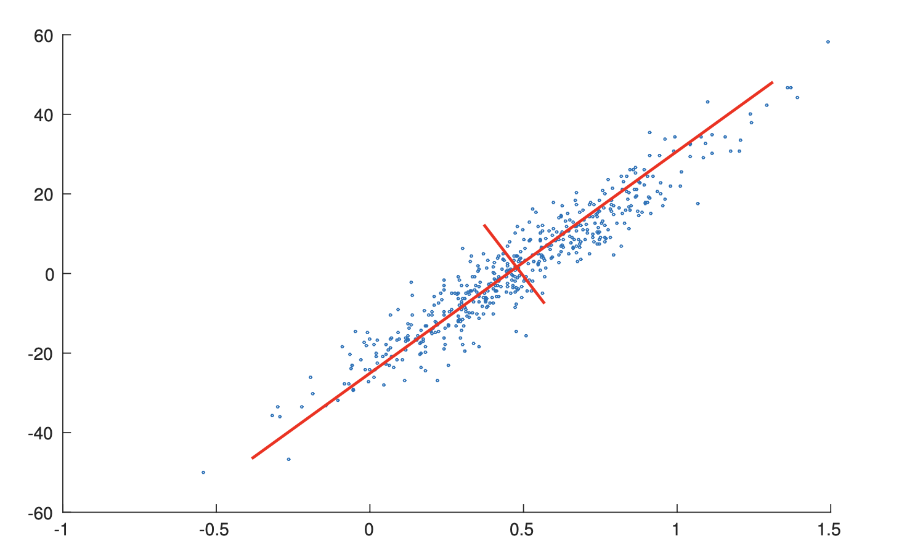
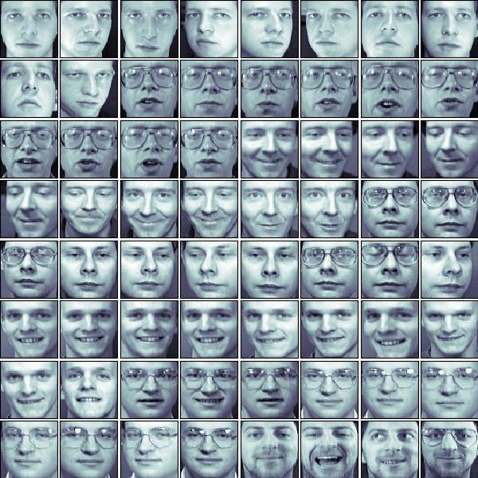
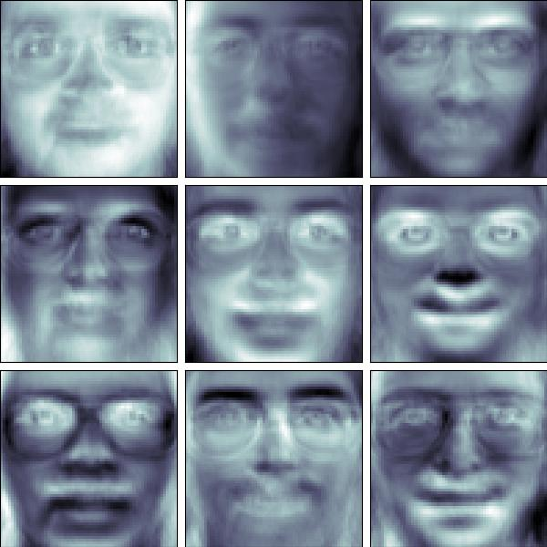
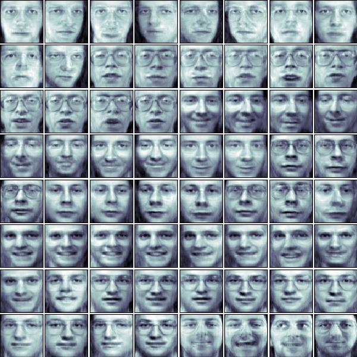

*From my perspective, PCA is not well explained in scikit-learn's official [User Guide](https://scikit-learn.org/stable/modules/decomposition.html#pca) and I found many interesting resources[^1][^2][^3] on the internet when I implemented this algorithm myself. Therefore I'll try to give a brief introduction of PCA here, hope this can help you :).*

# Principal Component Analysis (PCA)

PCA is a widely used linear dimensionality reduction method, and it can also be viewed as a linear feature extraction method. One may wonder why we need to reduce the dimension of the data, here are a few advantages:
* Lower resource requirements.
* Removal of noise.
* Better explanation and understanding.

## Basic Intuition

If I'm only allowed to use one sentence to explain what PCA does, I would say PCA aims to construct new features using existing features. What's more, these new features are **linear combinations of existing features**, and that's why we say PCA is a **linear** feature extraction method. For example, assume the original data has four features, and let's simply call them \\(F_1,F_2,F_3\\) and \\(F_4\\), the newly constructed feature \\(F^{\mathrm{new}}_1\\) is just a simple linear combination of the existing feature values

\\[F^{\mathrm{new}}_1 = 0.53\times F_1+0.43\times F_2+0.33\times F_3+0.18\times F_4~\.\\]

The new feature, constructed by PCA, can better summarize the data. We can perform dimensionality reduction by selecting a subset of these new features while yet preserve as much information as we could. This is possible because there is usually redundancy in the original representation of the data. I'll provide an overly simple example here to help you understand this. Suppose we want to fit a model that can predict one's income based on some information about this person. And assume in the training set we collected, a person is described by his/her gender, birth date, age and level of education. Directly using this dataset result in a four dimensional feature vector for each person, but it is not hard to find out that birth date and age are actually correlated. Thus, one of them can be safely removed and a lower dimensional representation can be obtained without losing any information. In practice, things are usually much more complicated and we cannot simply find these redundancies by hand. That's when PCA comes to help.

## What Makes a Feature "Good"?

The above desciption only provides you with some basic intuition behind PCA. One of the most important things we haven't touched is perhaps how we define "good" features. There are actually two perpectives, one from maximizing the variances and the other one from minimizing the reconstruction error, and they are equivalent.

### Variance

From the perspective of variance maximization, a good feature is the one that strongly differs across all data points[^1]. This is equivalent to finding a hyperplane on the original feature space such that when we project all data points onto this hyperplane, the result points have maximum variances. For example, in the figure[^4] below, the length of the red line represents the variance when projecting data onto this line. Projection that has higher variance means more information is preserved.

<div align=center>

<center style="font-size:14px;color:#C0C0C0;">Variance of projected values.</center> 
</div>

### Reconstruction Error

From the perspective of minimizing the reconstruction error, a good feature is the one that allows us to reconstruct the original feature representation as precise as possible. This is equivalent to finding a hyperplane in the original feature space, such that the Euclidean distance between the original data points and the projected points are minimized. The gif[^1] below gives a nice visualization about this, where the length of lines between the red dots (the new representation) and the blue dots (the original representation) denotes the reconstruction error.

<div align=center>

<center style="font-size:14px;color:#C0C0C0;">Recontruction error.</center> 
</div>

## The PCA Solution: From the Variance Maximization Perspective

As we've mentioned above, the two perspectives are equivalent, which means we can start from either one and eventually will reach the same solution. Here we start from the variance perspective because the derivation will be simpler. Life is hard already so here let's just try to make things easier. The derivation I'm about to present here is based on [the proof given by cardinal](https://stats.stackexchange.com/a/10256/28666).

From the variance maximization perspective, the goal of PCA is to find a hyperplane such that the projections of points on this hyperplane has maximum variance. This goal can be formalized into an constrained convex optimization problem. Specifically, a hyperplane can be described by an unit vector \\(w\\) in the original feature space and the projection of the original data on this plane is simply

\\[Xw\\]

where \\(X\\) is the data matrix where each row represents one data point. Therefore, the variance of the projected values are

\\[\frac{1}{n-1}w^T(X-\overline{X})^T(X-\overline{X})w~\.\\]

Denote \\(S=(X-\overline{X})^T(X-\overline{X})\\), the optimization problem can be written as

\\[\mathrm{maximize}\quad w^TSw\\]
\\[\mathrm{ s.t.}\quad w^Tw=1~\.\\]

Since \\(S\\) is a symmetric real matrix, by spectral theorem, we know it can be diagonalized

\\[S=Q\Lambda Q^T\\]

where \\(Q\\) is an orthonormal matrix. Thus we can write the objective as

\\[w^TSw=w^TQ\Lambda Q^Tw=u^T\Lambda u=\sum_{i}\lambda_i u_i~\.\\]

Since \\(w\\) is of unit length and \\(Q\\) is a orthonormal matrix, \\(u\\) here must also be a unit length vector. Therefore, to maximize the objective function under such constraint, it's not hard to see we need to have \\(u_{\arg\max_i \lambda_i}=1\\) while all other \\(u_i=0\\). Since \\(\lambda_i\\) is the eigenvalue and given the fact that \\(u=Q^Tw\\), we know \\(w^*\\) must be the eigenvector corresponds to the largest eigenvalue.

Therefore, we now construct the first new feature (in Pudding, this is called **principal axes**). And by projecting the centered data points onto this hyperplane, we obtain the value of each data point when they are described by this feature (in Pudding, this is called **principal components**). In order to find more new features (another hyperplane denoted by another unit vector \\(w\\)), we construct another constrained optimization problem. This one is similar to the one above, but we now have an additional equality constraint

\\[\mathrm{maximize}\quad w^TSw\\]
\\[\mathrm{ s.t.}\quad w^Tw=1\\]
\\[\mathrm{ s.t.}\quad w^Tw_1=0~\.\\]

where \\(w_1\\) is the optimal hyperplane we found above (be aware here that \\(w\\) is a variable while \\(w_1\\) is a fixed value). Solving this optimization is similar as above and we can easily find \\(w^*\\) here should be the eigenvector of the second largest eigenvalue.


## Maximizing Variance = Minimizing Reconstruction Error

The proof I present here is based on the proof given by amoeba[^2].

From the perspective of reconstruction error minimization, we still want to find a hyperplane \\(w\\) such that the reconstruction error is minimized. The reconstructed representation using the projection on \\(w\\) is given by

\\[Xww^T.\\]

Therefore, the objective function is

\begin{align}
    \Vert X-Xww^T \Vert^2&=\mathrm{tr}\left( (X-Xww^T)(X-Xww^T)^T \right)\\\\\\
    &=\mathrm{tr}\left( (X-Xww^T)(X^T-ww^TX^T) \right)\\\\\\
    &=\mathrm{tr}(XX^T)-2\mathrm{tr}(Xww^TX^T)+\mathrm{tr}(Xww^Tww^TX^T)\\\\\\
    &=\mathrm{const} - \mathrm{tr}(Xww^TX^T)\\\\\\
    &=\mathrm{const} - \mathrm{tr}(w^TX^TXw)\\\\\\
    &=\mathrm{const} - w^TSw~\.
\end{align}

That's to say, minimizing the reconstruction error is equivalent to maximizing the variance.

## PCA through SVD

Although in the derivation above, the solution of PCA is based on the eigendecomposition of the covariance matrix \\(S\\) (stricly speaking, \\(S/(n-1)\\) is the covariance matrix). But in practice, as well as the implementation in Pudding, it is done via [Singular Value Decomposition](http://en.wikipedia.org/wiki/Singular_value_decomposition). SVD is used because it is more numerically stable. Assume each row in the data matrix represents one data point. The PCA algorithm using SVD is as follows:
1. Center the data matrix by performing \\(X-\overline{X}\\).
2. Perform SVD on the centered matrix \\(X-\overline{X}=USV^T\\).
3. The columns of \\(V\\) are principal axes.
4. The columns of \\(US\\) are principal components.
5. The eigenvalues (i.e. variances) is given by \\(\lambda_i=s_i^2/(n-1)\\).
6. The reconstruction result using the first K principal axes is given by \\(U_kS_kV_k^T + \overline{X}\\) where \\(U_k\\) is the matrix where its columns are the k principal axes.

# One Application: Face Decomposition

Face decomposition is an interesting application of PCA. Given a face dataset, the training data is raw image, which is a rather high dimensional representation and has many redundancy. Therefore, we can use PCA to extract a new, lower dimensional representation from the raw pixels and the result principal axes are known as "eigenfaces". This lower dimensional representation can then be used as input to a classification model like SVM to perform face recognition. Here we only focus on the feature extraction part and omit the classification model.

Code corresponds to this application can be found in ```examples/dimension_reduction/pca/face_decomposition.py```.

```python
'''
This example script is based on Shankar Muthuswamy's blog about PCA
https://shankarmsy.github.io/posts/pca-sklearn.html
'''

import matplotlib.pyplot as plt
import numpy as np
from sklearn.datasets import fetch_olivetti_faces

from pudding.dimension_reduction import PCA

# First, load the dataset and visualize the faces
oliv = fetch_olivetti_faces(data_home='.')
fig = plt.figure(figsize=(6, 6))
fig.subplots_adjust(left=0, right=1, bottom=0, top=1, hspace=0.05, wspace=0.05)
for i in range(64):
    ax = fig.add_subplot(8, 8, i + 1, xticks=[], yticks=[])
    ax.imshow(oliv.images[i], cmap=plt.cm.bone, interpolation='nearest') 

plt.savefig('face_preview.jpg')

# Project the original face dataset into a lower dimensional feature space
# Let's say, from 4096 -> 64
pca = PCA(n_components=64)
pca.fit(oliv.data)
principal_components, principal_axes, reconstructed_X = pca.principal_components, pca.principal_axes, pca.reconstructed_X

# Visualize the top 9 principal axes
fig = plt.figure(figsize=(6, 6))
fig.subplots_adjust(left=0, right=1, bottom=0, top=1, hspace=0.05, wspace=0.05)
for i in range(9):
    ax = fig.add_subplot(3, 3, i + 1, xticks=[], yticks=[])
    ax.imshow(np.reshape(np.array(principal_axes)[i, :], (64, 64)), cmap=plt.cm.bone, interpolation='nearest') 

fig.savefig('principal_axes.jpg')

# Display the recontruction of the original face image from the 64-dim lower representation
reconstructed_img = np.reshape(reconstructed_X,(400,64,64))
fig = plt.figure(figsize=(6, 6))
fig.subplots_adjust(left=0, right=1, bottom=0, top=1, hspace=0.05, wspace=0.05)
for i in range(64):
    ax = fig.add_subplot(8, 8, i + 1, xticks=[], yticks=[])
    ax.imshow(reconstructed_img[i], cmap=plt.cm.bone, interpolation='nearest') 

fig.savefig('reconstructed_images.jpg')
```

The original face images are shown below.

<div align=center>

<center style="font-size:14px;color:#C0C0C0;">The original face images.</center> 
</div>

The top 9 eigenfaces we extract are shown below.

<div align=center>

<center style="font-size:14px;color:#C0C0C0;">The top 9 eigenfaces.</center> 
</div>

Using the lower dimensional representation, we can reconstruct the original images.

<div align=center>

<center style="font-size:14px;color:#C0C0C0;">The reconstructed face images.</center> 
</div>

As we can see, the reconstruction result looks pretty well.

# References
[^1]: amoeba (https://stats.stackexchange.com/users/28666/amoeba), Making sense of principal component analysis, eigenvectors & eigenvalues, URL (version: 2021-12-03): https://stats.stackexchange.com/q/140579

[^2]: amoeba (https://stats.stackexchange.com/users/28666/amoeba), PCA objective function: what is the connection between maximizing variance and minimizing error?, URL (version: 2015-02-03): https://stats.stackexchange.com/q/136072

[^3]: amoeba (https://stats.stackexchange.com/users/28666/amoeba), What is an intuitive explanation for how PCA turns from a geometric problem (with distances) to a linear algebra problem (with eigenvectors)?, URL (version: 2018-12-09): https://stats.stackexchange.com/q/219344

[^4]: Wu, Jianxin. Essentials of Pattern Recognition: An Accessible Approach. Cambridge University Press, 2020.
