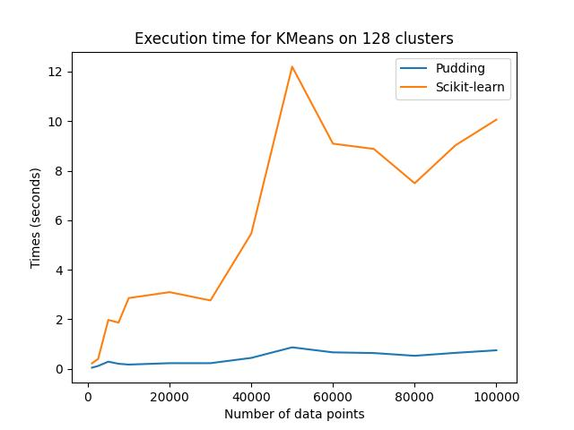

[Go Back](index.md)

# KMeans Clustering

KMeans is a simple and widely used clustering algorithm. Generally speaking, it tries to cluster data by minimizing the within-cluster sum-of-squares error. For more information about this algorithm, one can refer to this [site](https://scikit-learn.org/stable/modules/clustering.html#k-means).

# Benchmark Result

The GPU version of KMeans is benchmarked with respect to a naive CPU version implemented by me and a fully optimized CPU version implemented in scikit learn. You can perform the benchmark simply by running the Python script ```scripts/benchmark_kmeans.py```.

Specifically, we randonly sample 100,000 points in a 3D space using the ```make_blobs``` function provided in the ```sklearn.datasets``` package. We choose a series of different cluster numbers varying from 8 to 128. The results are summarized in the following table:

|Number of Clusters|Naive CPU Run Time (sec)|Sci-kit Run Time (sec)|GPU Run Time (sec)|Naive CPU Run Time / GPU Run Time|
|:-:|:-:|:-:|:-:|:-:|
|8|1.158|0.168|0.045|25.46x|
|16|2.989|0.323|0.123|24.36x|
|32|13.800|0.811|0.514|26.83x|
|64|21.721|1.651|0.793|27.39x|
|128|55.437|3.124|2.157|25.70x|

As we can see, the GPU version achieves a significant speedup compare to the naive CPU version. And when compared to a fully optimized CPU version like the implementation in scikit-learn, the GPU version is still much faster.

<div align=center>

<center style="font-size:14px;color:#C0C0C0;">Benchmark result.</center> 
</div>

# One Application: Image Quantization

One interesting application of the KMeans algorithm is image quantization. The task is simple, given an image that has many different colors in it, we perform KMeans clustering on the pixels in the image and discover a small set of clusters (e.g. 64). Then for every pixel, we use its corresponding cluster center to replace its original value. By dong so, we are able to use a much smaller number of colors to represent an image.

The code corresponds to this example can be found in ```examples/clustering/kmeans/image_quantization.py```. Specifically, we perform KMeans clustering on all pixles in a 1080p high resolution image. For the exactly same task, **KMeans in scikit-learn uses 35 seconds while our implementation only uses 14 seconds**. Check out the code and run the example yourself!

```python
'''
This script is based on scikit-learn's official example of image quantization.
https://scikit-learn.org/stable/auto_examples/cluster/plot_color_quantization.html#sphx-glr-auto-examples-cluster-plot-color-quantization-py
'''

import numpy as np
from PIL import Image
from time import time
from sklearn.cluster import KMeans

import pudding

n_colors = 64

# Load the sample photo
image = Image.open('image.jpg')

# Dividing by 255 so that the value is in the range [0-1]
image = np.array(image, dtype=np.float64) / 255

# Transform the image to a 2D numpy array.
w, h, d = original_shape = tuple(image.shape)
assert d == 3
image_array = np.reshape(image, (w * h, d))

print('Perform the KMeans clustering using scit-kit learn...')
t0 = time()
scikit_kmeans = KMeans(n_clusters=n_colors, n_init=1)
scikit_kmeans.fit(image_array)
print(f'Done in {time() - t0:0.3f}s.')

print("Perform the KMeans clustering using Pudding on GPU...")
t1 = time()
pudding_kmeans = pudding.clustering.KMeans(n_clusters=n_colors, cuda_enabled=True)
pudding_kmeans.fit(image_array)
centers, membership = pudding_kmeans.centers, pudding_kmeans.membership
assert not np.isnan(centers).any()
print(f"Done in {time() - t1:0.3f}s.")

def recreate_image(codebook, labels, w, h):
    """Recreate the (compressed) image from the code book & labels"""
    return codebook[labels].reshape(w, h, -1)

# Save the quantized image
np_image = recreate_image(np.array(centers), np.array(membership), w, h)
formatted_image = (np_image * 255).astype(np.uint8)
quantized_image = Image.fromarray(formatted_image)
quantized_image.save('quantized_pudding.jpg')

np_image = recreate_image(scikit_kmeans.cluster_centers_, scikit_kmeans.labels_, w, h)
formatted_image = (np_image * 255).astype(np.uint8)
quantized_image = Image.fromarray(formatted_image)
quantized_image.save('quantized_sklearn.jpg')
```

<div align=center>

<center style="font-size:14px;color:#C0C0C0;">The original image.</center> 
</div>

<div align=center>

<center style="font-size:14px;color:#C0C0C0;">Scikit-learn result.</center>
</div> 

<div align=center>

<center style="font-size:14px;color:#C0C0C0;">Pudding result.</center>
</div> 


# Notes on Usage

There are a few things that need careful consideration when using KMeans on your own dataset.

1. The choice of the number of clusters. Since KMeans requires the number of clusters to be specified, it is important to choose an appropriate number.
2. The choice of the initial cluster centers. This is also of vital importance to the KMeans algorithm. Pudding currently only supports random cluster center initialization, so if you find the outcome of the algorithm not satisfactory, you can either try to mannualy set the initial center using some prior knowledge about the specific dataset you are using or re-run the algorithm with the ```rand_seed``` parameter set to a different value. I may in the near future add more features like the support of the ```kmeans++``` algorithm.
3. The constraint on the dimension. "Curse of dimension" is a well-known problem for KMeans clustering since it uses Euclidean distance, which often fails when dimension becomes high. If the dimension of your data is rather high (e.g. >= 10), you probably need to use some dimensional reduction techniques like PCA to first project the data in a lower dimensional space before you perform KMeans on them.